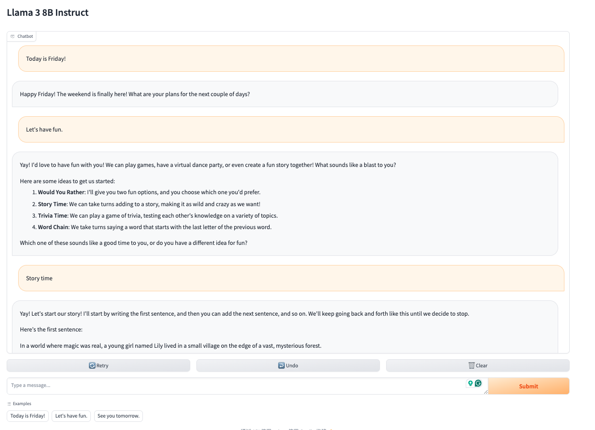

Utilizing the Meta Llama 3 Instruct with 8 billion parameters from hugging face to create

**1. a machine translation chatbot**

Try the machine translation chatbot published url here: 
https://huggingface.co/spaces/qdai/LLM3_Model

**2. a conversational chatbot**

